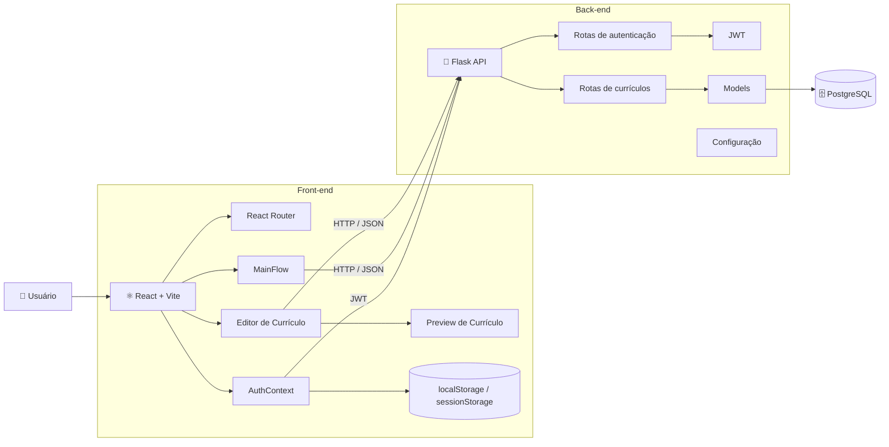

# CVFlow V1.0

Plataforma para criação, personalização e otimização de currículos profissionais.

## 🎯 Sobre o projeto

O CVFlow foi desenvolvido com o objetivo de facilitar a criação de currículos profissionais e permitir que candidatos adaptem seus currículos para diferentes oportunidades.

A plataforma permite centralizar informações profissionais, criar diferentes versões de currículo, visualizar o resultado em tempo real e exportar o documento em PDF.

## 🚀 Funcionalidades

- [x] Cadastro e autenticação de usuários
- [x] Perfil profissional
- [x] Cadastro de experiências
- [x] Cadastro de projetos
- [x] Cadastro de habilidades
- [x] Criação de currículos
- [x] Templates profissionais
- [x] Preview em tempo real
- [x] Exportação para PDF
- [x] Compatibilidade com ATS
- [x] Gerenciamento de currículos
- [x] Visualização de currículos salvos
- [x] Autenticação utilizando JWT
- [x] Interface responsiva

## 🛠️ Tecnologias

### Front-end

- **React** — construção da interface e desenvolvimento de componentes reutilizáveis.
- **JavaScript (ES6+)** — lógica e comportamento da aplicação.
- **Vite** — ambiente de desenvolvimento e build do projeto React.
- **React Router DOM** — gerenciamento das rotas e navegação da aplicação.
- **HTML5** — estrutura das interfaces.
- **CSS3** — estilização, responsividade e construção dos layouts.
- **Lucide React** — biblioteca de ícones utilizada na interface.
- **React Hooks** — gerenciamento de estado, efeitos, referências e contexto utilizando `useState`, `useEffect`, `useContext`, `useMemo`, `useRef`, `useLayoutEffect`, entre outros.

### Back-end

- **Python** — linguagem utilizada no desenvolvimento do servidor.
- **Flask** — framework responsável pela construção da API.
- **REST API** — comunicação entre o front-end e o back-end através de endpoints HTTP.
- **JSON** — formato utilizado na comunicação entre as aplicações e na estrutura dos dados dos currículos.
- **Flask-CORS** — configuração de comunicação entre front-end e API em diferentes origens.

### Banco de dados

- **PostgreSQL** — banco de dados utilizado para persistência das informações dos usuários e currículos.

### Autenticação e segurança

- **JWT (JSON Web Token)** — mecanismo utilizado para autenticação das requisições protegidas.
- **Bearer Token** — envio do token através do header `Authorization`.
- **localStorage / sessionStorage** — armazenamento do token de autenticação conforme a opção de permanência da sessão.
- **Rotas protegidas** — controle de acesso às áreas internas da aplicação.

## 🏗️ Arquitetura

O CVFlow utiliza uma arquitetura baseada na separação entre **Front-end**, **API Back-end** e **Banco de Dados**.

O front-end é desenvolvido como uma aplicação **SPA (Single Page Application)** utilizando React e Vite. A comunicação com o back-end ocorre através de uma API REST utilizando HTTP e JSON, enquanto a autenticação das requisições protegidas utiliza JWT.



### Fluxo de comunicação

De forma simplificada, o fluxo da aplicação ocorre da seguinte maneira:

```text
Usuário
   ↓
Front-end React
   ↓ HTTP / JSON + JWT
Flask API
   ↓
PostgreSQL
```

O React é responsável pela interface e interação com o usuário, o Flask processa as requisições e regras da aplicação, e o PostgreSQL realiza a persistência dos dados.

## 📐 Estrutura do projeto

A aplicação é organizada separando as responsabilidades entre front-end e back-end.

```text
CVFlow/
│
├── Frontend/
│   └── cvflow-frontend/
│       ├── src/
│       │   ├── components/
│       │   ├── context/
│       │   ├── pages/
│       │   ├── utils/
│       │   └── ...
│       │
│       └── ...
│
└── Backend/
    ├── routes/
    ├── models/
    ├── utils/
    ├── app.py
    ├── config.py
    ├── extensions.py
    └── requirements.txt
```

## 🧩 Principais conceitos utilizados

Durante o desenvolvimento do CVFlow foram utilizados conceitos e práticas como:

- Componentização
- SPA (Single Page Application)
- Gerenciamento de estado
- Context API
- Hooks do React
- Rotas protegidas
- Autenticação baseada em JWT
- API REST
- Integração entre Front-end e Back-end
- Operações CRUD
- Comunicação HTTP/JSON
- Renderização condicional
- Modais
- Preview dinâmico de currículos
- Exportação de currículos em PDF
- Design responsivo
- Organização de responsabilidades entre camadas

## 📄 Templates de currículo

O CVFlow possui diferentes modelos de currículo para atender diferentes estilos de apresentação profissional.

Atualmente, a aplicação trabalha com modelos como:

- **ATS**
- **Moderno**
- **Executivo**

Cada modelo possui uma estrutura visual própria e utiliza os mesmos dados profissionais fornecidos pelo usuário.

## 📥 Exportação para PDF

Após criar ou visualizar um currículo, o usuário pode exportar o documento para PDF.

O sistema utiliza uma área específica de renderização do currículo para gerar o arquivo final mantendo a estrutura visual do template selecionado.

## 🔐 Autenticação

A autenticação da aplicação utiliza JWT.

Após o login, o token é armazenado no navegador de acordo com a opção escolhida pelo usuário:

- `localStorage` — quando a opção de permanência da sessão está habilitada.
- `sessionStorage` — quando a sessão deve permanecer apenas enquanto o navegador estiver aberto.

As páginas internas da aplicação utilizam rotas protegidas para impedir o acesso de usuários não autenticados.

## 📌 Roadmap

- [ ] Aprimorar a otimização de currículos para diferentes vagas.
- [ ] Evoluir a análise de compatibilidade com ATS.
- [ ] Adicionar novos templates profissionais.
- [ ] Melhorar a personalização dos currículos.
- [ ] Adicionar novas ferramentas para gerenciamento de versões.
- [ ] Evoluir recursos de análise e sugestões para o currículo.

## 📚 Objetivo do projeto

Além de ser uma plataforma voltada à criação de currículos, o CVFlow também foi desenvolvido como projeto prático para aplicação de conhecimentos em:

**React + JavaScript + Flask + PostgreSQL + APIs REST + Autenticação JWT**

O projeto envolve desde a construção da interface até a comunicação com o servidor, persistência de dados, autenticação e geração dos documentos.

## 👨‍💻 Autor

**Eduardo Guilherme**

Estudante de Sistemas de Informação e desenvolvedor Front-End.

---

⭐ Projeto desenvolvido como parte do portfólio pessoal e para aplicação prática de conceitos de desenvolvimento web full-stack.
